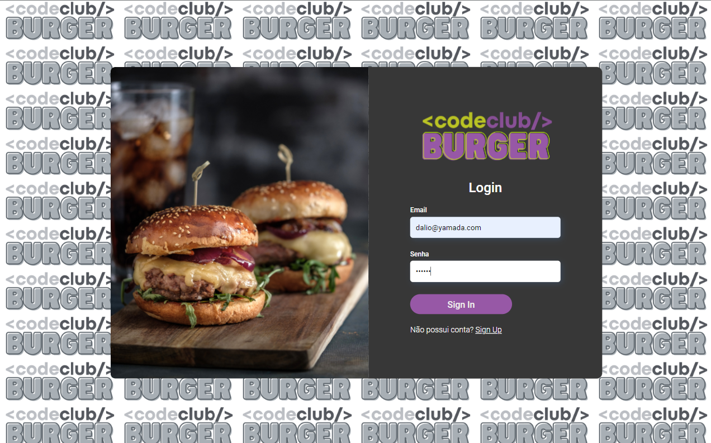
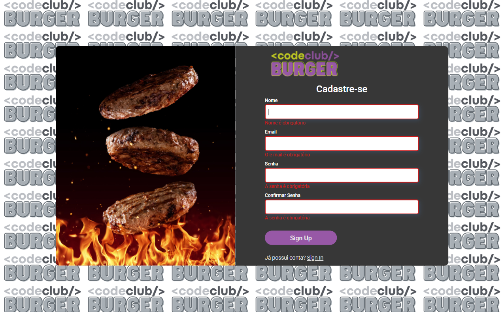
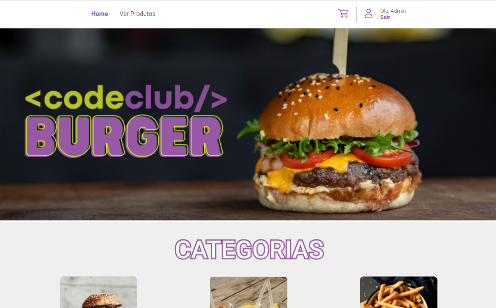
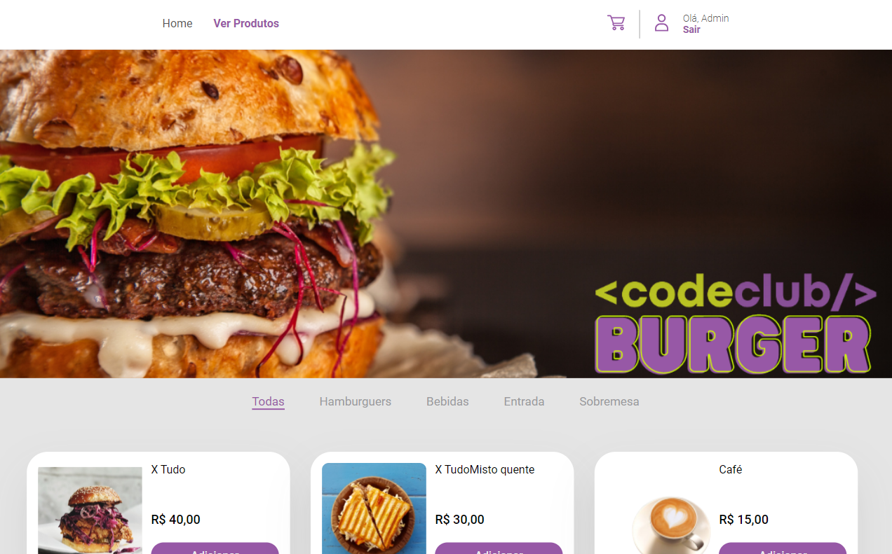
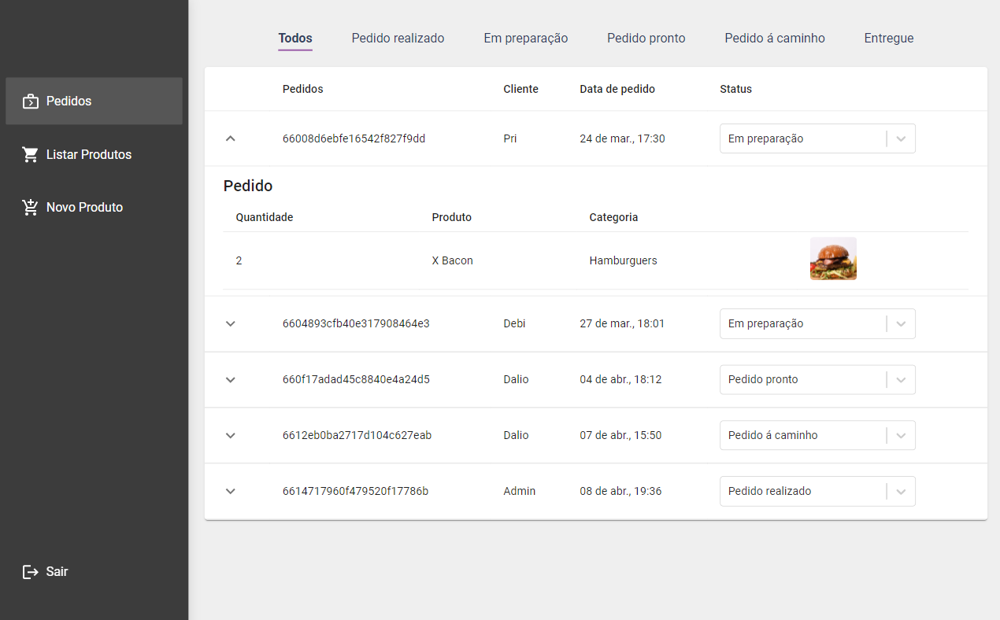
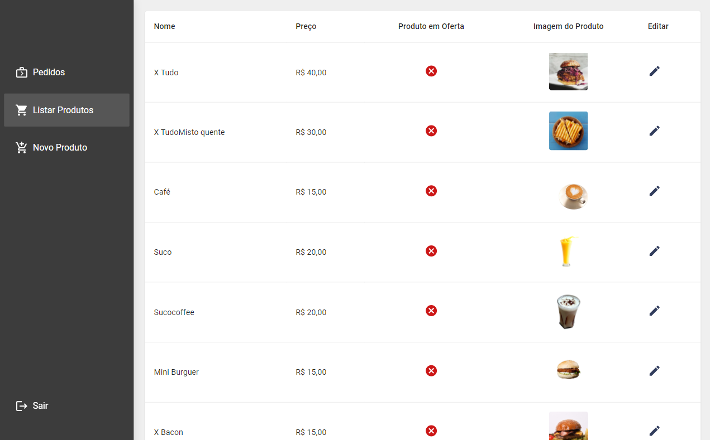
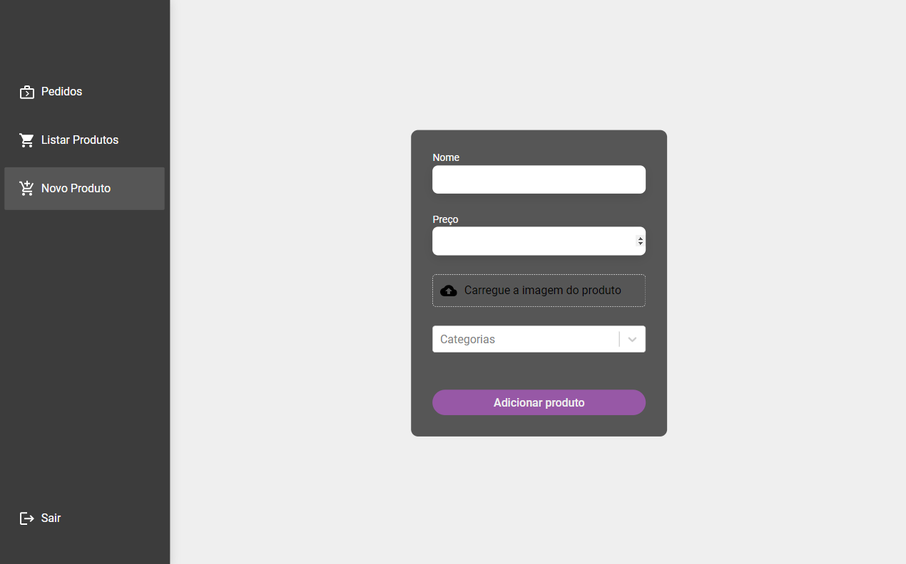

<h1 align="center">Front-End CodeBurguer</h1>

<h2>Olá sejam bem-vindo</h2>

Projeto Front-End CodeBurguer

Com o auxílio do meu mentor Rodolfo Mori, desenvolvi um projeto completo para uma hamburgueria utilizando React, API e Área Admin. O site oferece uma experiência completa para os clientes, desde a navegação intuitiva até a compra final.

<h4>Funcionalidades:</h4>
<ul>
<li>🌮 Divisão de categorias: Organizei os hambúrgueres por categorias como carne bovina, frango, vegetariano e vegano, facilitando a busca do cliente.</li>
<li>🛒 Adição no carrinho: O cliente pode adicionar os hambúrgueres favoritos ao carrinho com apenas alguns cliques, com direito a personalização de ingredientes e acompanhamentos.</li>
<li>🔐 Área Admin: Criei uma área administrativa completa para gerenciamento de pedidos, processo, produtos...</li>
</ul>

<h4>Tecnologias:</h4>
<ul>
<li>⚙ React: Framework JavaScript para interfaces de usuário interativas e responsivas.</li>
<li>🔧 API: Criei uma API para comunicação entre o frontend e o backend.</li>
</ul>

Este projeto me proporcionou a oportunidade de aprofundar meus conhecimentos em diversas tecnologias de back-end, como Node.js, Express, bancos de dados relacionais e não relacionais, Docker, testes automatizados e segurança.

Gostaria de agradecer ao meu mentor, Rodolfo do Dev Club, pelo seu apoio, orientação e valiosos ensinamentos durante todo o desenvolvimento deste projeto.

<h4>Link:</h4>

>Repoditório: https://github.com/DalioSY/front-end-codeburger

>Linkedin: https://www.linkedin.com/in/dalio-s-yamada/

#hamburgueria #HTML #CSS #JavaScript #Github #React.js #Typescript #Node.js #Api #Express #Sequelize #Postgresql #Docker #FrontEnd #BackEnd #FullStack #Programador #Dev #Web #Desenvolvedor-Web #DesenvolvedorFrontEnd #DesenvolvedorBackEnd #DesenvolvedorFullStack #TransiçãoDeCarreira #jornadaproficional #aprendendo #tecnologia #openToWork #Recruiter #rh

 

  <ul align="center">
    <h2 style="display: inline-block">Imagens:</h2>
  </ul>

 
  
  
  
  
  
  
  
  

